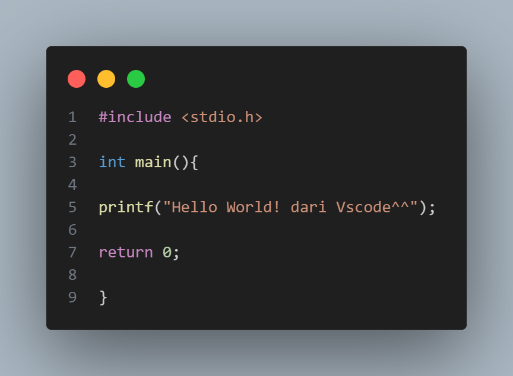

<!-- PROJECT LOGO -->
 

  

<h3 align="center">WEEKLY REPORT ALGORITMA PEMROGRAMAN</h3>

  

   NAMA : DEALEXA FATIKA DZIKRA 
   NIM  : 24343031
    
  

<!-- TABLE OF CONTENTS -->

  
Table of Contents

  <ol>
    <li>
      <a href="#about-the-project">About The Project</a>
      <ul>
        <li><a href="#built-with">Built With</a></li>
      </ul>
    </li>
    <li>
      <a href="#getting-started">Getting Started</a>
      <ul>
        <li><a href="#prerequisites">Prerequisites</a></li>
        <li><a href="#installation">Installation</a></li>
      </ul>
    </li>
    <li><a href="#usage">Usage</a></li>
    <li><a href="#roadmap">Roadmap</a></li>
    <li><a href="#contributing">Contributing</a></li>
    <li><a href="#license">License</a></li>
    <li><a href="#contact">Contact</a></li>
    <li><a href="#acknowledgments">Acknowledgments</a></li>
  </ol>

1. [JOB SHEET 1](https://github.com/dealexaa/Weekly-Report-Algoritma-24343031-Dealexa-Fatika-Dzikra/edit/main/README.md#job-sheet-1-pengantar-algoritma-dan-pemrograman)
2. [Requirements](#requirements)
3. [Installation](#installation)
4. [Usage](#usage)
5. [Code Explanation](#code-explanation)
6. [Conclusion](#conclusion)

<!-- ABOUT THE PROJECT -->
## JOB SHEET 1-Pengantar Algoritma dan Pemrograman

<h3 align="left">Latihan 1 : Pengertian Algoritma, Pemrograman, Program, Programmer, dan IDE</h3>
  

  <b>Algoritma</b> adalah urutan langkah-langkah yang disusun secara sistematis dan
logis untuk menyelesaikan suatu masalah atau mencapai suatu tujuan tertentu.
Sebuah algoritma mempunyai awal dan akhir.  
 Algoritma adalah jantung ilmu komputer atau informatika. Banyak cabang
ilmu komputer yang di acu dalam terminologi algoritma. Namun, jangan
beranggapan algoritma selalu identik dengan ilmu komputer saja. Dalam
kehidupan sehari-hari pun banyak terdapat proses yang dinyatakan dalam
suatu algoritma. Berikut adalah beberapa contoh algoritma dalam kehidupan
sehari-hari :
 

<b>Pemrograman</b> bisa diartikan sebuah tindakan atau aktivitas penulisan,
menguji, memperbaiki, dan memelihara kode yang dipahami oleh komputer.
Pemrograman adalah proses penulisan kode menjadi sebuah program.Sementara orang yang melakukan pemrograman disebut dengan <b>programmer</b>,
sedangkan <b>program</b> adalah produk dari proses pemrograman yang dilakukan.

 <b>IDE atau Integrated Development Environment</b> adalah software atau
perangkat lunak yang digunakan oleh programmer untuk membuat sebuah
program komputer atau sebagai tempat pengembangan aplikasi. Berbeda
dengan text editor seperti notepad, IDE merupakan text editor yang memiliki
compiler dan debugger sekaligus sehingga memungkinkan sebuah program
dapat ditulis, diuji, dan dijalankan dalam satu aplikasi. IDE memiliki banyak
fitur yang mendukung proses pemrograman. Contohnya adalah DevC++,
Microsoft Visual Studio, CodeBlocks, NetBeans, Eclips, dll.    
  

  <h3 align="left">Latihan 2 : Melakukan instalasi IDE</h3>
  Anda bisa memilih diantara IDE berikut : 
➢ DevC++ 
➢ Visual Studio Code 
➢ CodeBlocks 
  Tetapi pada program ini saya menggunakan Visual Studio Code,Berikut cara instalasinya : 
  1.Unduh Visual Studio Code dari <a href="https://code.visualstudio.com/download"> tautan resmi.</a> 
  2.Instal sesuai instruksi pada layar. 
  3.Pastikan compiler seperti MinGW terpasang. 

  <h3 align="left">Latihan 3 : Program "Hello World"</h3>
  
  

    <b>Deskipsi Program</b> 
    Program sederhana dalam bahasa C yang mencetak pesan ke konsol menggunakan fungsi printf. 
     
   <b>Penjelasan Tiap Baris</b> 
1.#include < stdio.h >  
Memasukkan pustaka standar untuk operasi input dan output, seperti printf. 
2.int main() 
Fungsi utama tempat program dimulai. 
3.printf("Hello World!\n"); 
Perintah untuk mencetak teks "Hello World!" ke layar. Tanda \n membuat program pindah ke baris baru setelah mencetak. 
4.return 0; 
Mengakhiri program dengan status sukses (kode 0). 

 
  

Here's a blank template to get started: To avoid retyping too much info. Do a search and replace with your text editor for the following: `github_username`, `repo_name`, `twitter_handle`, `linkedin_username`, `email_client`, `email`, `project_title`, `project_description`

(<a href="#readme-top">back to top</a>)

