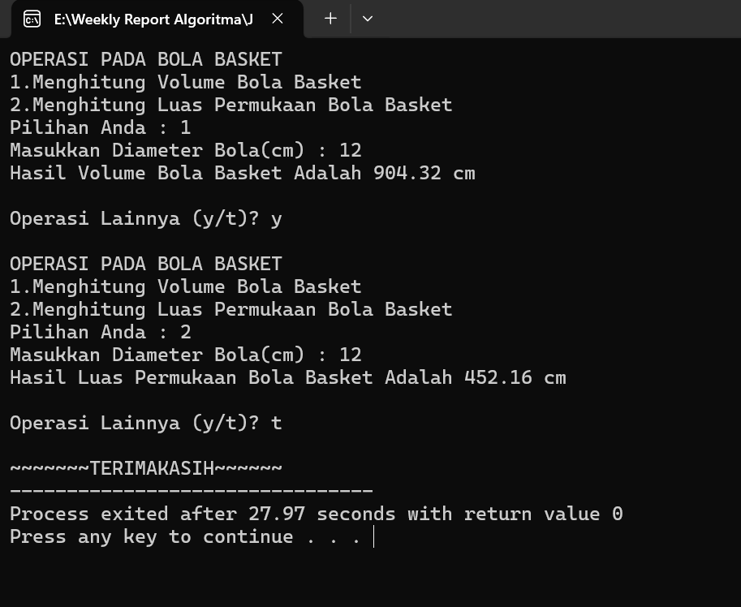
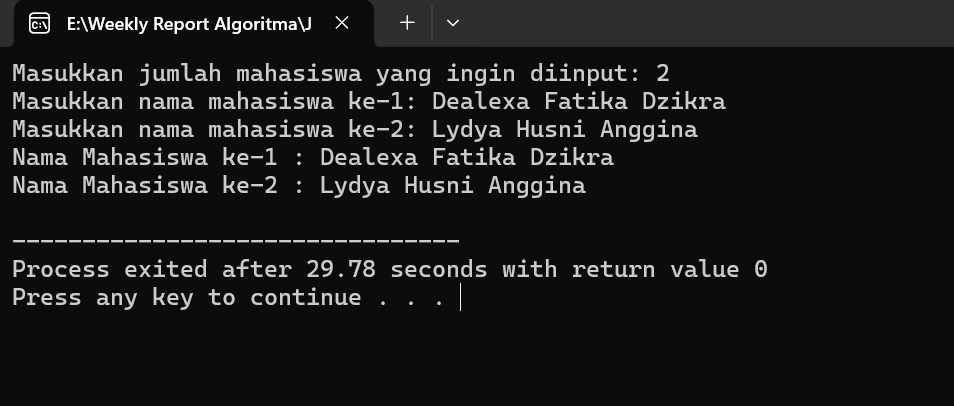
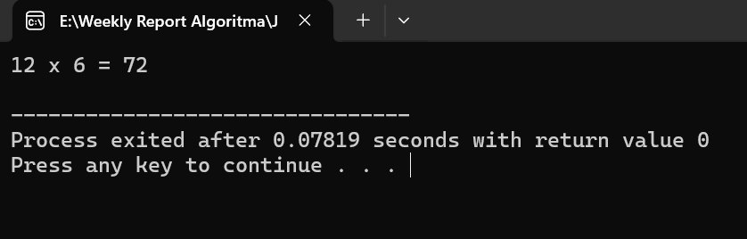

<!-- PROJECT LOGO -->

  

<h3 align="center">WEEKLY REPORT ALGORITMA PEMROGRAMAN</h3>

  

   NAMA : DEALEXA FATIKA DZIKRA 
   NIM  : 24343031
    
  

<!-- Table of Contents -->
# :notebook_with_decorative_cover: Table of Contents

<a href="https://github.com/dealexaa/Weekly-Report-Algoritma-24343031-Dealexa-Fatika-Dzikra/edit/main/README.md#job-sheet-1---pengantar-algoritma-dan-pemrograman"> JOB SHEET 1 - Pengantar Algoritma dan Pemrograman.</a>
- [JOB SHEET 1 - Pengantar Algoritma dan Pemrograman](#job-sheet-1---pengantar-algoritma-dan-pemrograman)
- [JOB SHEET 2-Pemograman Dasar C](#job-sheet-1---pengantar-algoritma-dan-pemrograman)
- [JOB SHEET 3-Variabel,Konstanta, dan Tipe Data](#job-sheet-1---pengantar-algoritma-dan-pemrograman)
- [JOB SHEET 4-Operator](#job-sheet-1---pengantar-algoritma-dan-pemrograman)
- [JOB SHEET 5-Flow Control (Decision Making)](#job-sheet-1---pengantar-algoritma-dan-pemrograman)
- [JOB SHEET 6-Flow Control (Looping)](#job-sheet-1---pengantar-algoritma-dan-pemrograman)
- [JOB SHEET 7-Array](#job-sheet-1---pengantar-algoritma-dan-pemrograman)
- [JOB SHEET 8- Fungsi dan Prosedur](#job-sheet-1---pengantar-algoritma-dan-pemrograman)
- [JOB SHEET 9-Pointer](#job-sheet-1---pengantar-algoritma-dan-pemrograman)
- [JOB SHEET 10-Enumerasi dan Structure](#job-sheet-1---pengantar-algoritma-dan-pemrograman)
- [JOB SHEET 11-File Handling in C](#job-sheet-1---pengantar-algoritma-dan-pemrograman)
  * [Screenshots](#camera-screenshots)
  * [Tech Stack](#space_invader-tech-stack)
  * [Features](#dart-features)
  * [Color Reference](#art-color-reference)
  * [Environment Variables](#key-environment-variables)
- [Getting Started](#toolbox-getting-started)
  * [Prerequisites](#bangbang-prerequisites)
  * [Installation](#gear-installation)
  * [Running Tests](#test_tube-running-tests)
  * [Run Locally](#running-run-locally)
  * [Deployment](#triangular_flag_on_post-deployment)
- [Usage](#eyes-usage)
- [Roadmap](#compass-roadmap)
- [Contributing](#wave-contributing)
  * [Code of Conduct](#scroll-code-of-conduct)
- [FAQ](#grey_question-faq)
- [License](#warning-license)
- [Contact](#handshake-contact)
- [Acknowledgements](#gem-acknowledgements)

<!-- ABOUT THE PROJECT -->
## JOB SHEET 1 - Pengantar Algoritma dan Pemrograman

<h3 align="left">Latihan 1 : Pengertian Algoritma, Pemrograman, Program, Programmer, dan IDE</h3>
  

  <b>Algoritma</b> adalah urutan langkah-langkah yang disusun secara sistematis dan
logis untuk menyelesaikan suatu masalah atau mencapai suatu tujuan tertentu.
Sebuah algoritma mempunyai awal dan akhir.  
 Algoritma adalah jantung ilmu komputer atau informatika. Banyak cabang
ilmu komputer yang di acu dalam terminologi algoritma. Namun, jangan
beranggapan algoritma selalu identik dengan ilmu komputer saja. Dalam
kehidupan sehari-hari pun banyak terdapat proses yang dinyatakan dalam
suatu algoritma. Berikut adalah beberapa contoh algoritma dalam kehidupan
sehari-hari :
 

<b>Pemrograman</b> bisa diartikan sebuah tindakan atau aktivitas penulisan,
menguji, memperbaiki, dan memelihara kode yang dipahami oleh komputer.
Pemrograman adalah proses penulisan kode menjadi sebuah program.Sementara orang yang melakukan pemrograman disebut dengan <b>programmer</b>,
sedangkan <b>program</b> adalah produk dari proses pemrograman yang dilakukan.

 <b>IDE atau Integrated Development Environment</b> adalah software atau
perangkat lunak yang digunakan oleh programmer untuk membuat sebuah
program komputer atau sebagai tempat pengembangan aplikasi. Berbeda
dengan text editor seperti notepad, IDE merupakan text editor yang memiliki
compiler dan debugger sekaligus sehingga memungkinkan sebuah program
dapat ditulis, diuji, dan dijalankan dalam satu aplikasi. IDE memiliki banyak
fitur yang mendukung proses pemrograman. Contohnya adalah DevC++,
Microsoft Visual Studio, CodeBlocks, NetBeans, Eclips, dll.    
  

  <h3 align="left">Latihan 2 : Melakukan instalasi IDE</h3>
  Anda bisa memilih diantara IDE berikut : 
➢ DevC++ 
➢ Visual Studio Code 
➢ CodeBlocks 
  Tetapi pada program ini saya menggunakan Visual Studio Code,Berikut cara instalasinya : 
  1.Unduh Visual Studio Code dari <a href="https://code.visualstudio.com/download"> tautan resmi.</a> 
  2.Instal sesuai instruksi pada layar. 
  3.Pastikan compiler seperti MinGW terpasang. 

  <h3 align="left">Latihan 3 : Program "Hello World"</h3>
  
  

    <b>Deskipsi Program</b> 
    Program sederhana dalam bahasa C yang mencetak pesan ke konsol menggunakan fungsi printf. 
     
   <b>Penjelasan Tiap Baris</b> 
1. #include < stdio.h >  
   Memasukkan pustaka standar untuk operasi input dan output, seperti printf. 
2. int main() 
   Fungsi utama tempat program dimulai. 
3. printf("Hello World!\n"); 
   Perintah untuk mencetak teks "Hello World!" ke layar. Tanda \n membuat program pindah ke baris baru setelah mencetak. 
4. return 0; 
   Mengakhiri program dengan status sukses (kode 0). 
Output :  
  
 
  

(<a href="#readme-top">back to top</a>)

## JOB SHEET 2-Pemograman Dasar C

<h3 align="left">Latihan 1 : Program "Selamat Datang dalam Pemograman C!"</h3>
   
  
  <b>Deskripsi Program</b> 
Program ini adalah aplikasi sederhana yang dibuat dengan bahasa C. Program ini bertujuan untuk menyapa pengguna dengan menampilkan pesan selamat datang yang ditampilkan berdasarkan nama lengkap yang dimasukkan oleh pengguna.Program akan menampilkan pesan “Selamat Datang <nama> dalam
Pemrograman C!” 

<b>Fitur</b> 
     - Input Nama Lengkap: Program meminta pengguna untuk memasukkan nama lengkap mereka. 
     - Output: Program menampilkan pesan selamat datang khusus menggunakan nama pengguna yang telah dimasukkan.
  
 <b>Struktur Program</b> 
Program ini terdiri dari bagian utama sebagai berikut: 

1. Header 
   Program menggunakan pustaka stdio.h untuk mengakses fungsi input-output seperti printf dan scanf. 
2. Variabel 
   char name[50]; : Sebuah array karakter untuk menyimpan nama lengkap pengguna hingga 50 karakter. 
3. Alur Program
   - Program menampilkan pesan untuk meminta pengguna memasukkan nama lengkap. 
   - Nama lengkap yang dimasukkan pengguna disimpan dalam variabel name menggunakan scanf. 
   - Program menampilkan pesan selamat datang yang memuat nama pengguna.    
  

 

<h3 align="left">Latihan 2 : Program Menentukan Nilai Akhir Mahasiswa</h3>
   
  
  <b>Deskripsi Program</b> 
Program ini adalah aplikasi sederhana yang memungkinkan pengguna untuk: 
1. Memasukkan informasi pribadi (Nama, NIM, Program Studi, dan Fakultas).
2. Memasukkan nilai praktikum, UTS, dan UAS.
3. Menghitung nilai akhir berdasarkan bobot:
   - 30% untuk nilai praktikum,
   - 30% untuk nilai UTS,
   - 40% untuk nilai UAS.
Program ini kemudian menampilkan informasi lengkap beserta nilai akhir pengguna.

<b>Fitur</b> 
1. Input Data Pribadi: 
    -  Nama Mahasiswa 
    -  NIM 
    -  Program Studi 
    - Fakultas 
2. Input Nilai Akademik: 
    -  Nilai Praktikum 
    -  Nilai UTS 
    -  Nilai UAS 
3. Perhitungan Nilai Akhir: 
   Menggunakan rumus berikut :  
   nilaiAkhir = (0.3 * praktikum) + (0.3 * uts) + (0.4 * uas);  
4. Output yang Informatif: 
   Menampilkan informasi lengkap (Nama, NIM, Prodi, Fakultas) dan nilai mahasiswa dan Nilai Akhirnya.
  
 <b>Struktur Program</b> 
Program ini terdiri dari bagian utama sebagai berikut: 

1. Header 
   Menggunakan pustaka stdio.h untuk fungsi input-output. 
2. Variabel 
   - Informasi Pribadi: char nama[100], NIM[100], prodi[100], fakultas[100] 
   - Nilai Akademik: float praktikum, uts, uas, nilaiAkhir. 
3. Alur Program
   - Input Data Pribadi: Pengguna diminta untuk memasukkan nama, NIM, program studi, dan fakultas. Data diambil menggunakan fungsi fgets untuk mendukung spasi dalam input. 
   - Input Nilai Akademik: Pengguna memasukkan nilai praktikum, UTS, dan UAS menggunakan scanf. 
   - Perhitungan Nilai Akhir: Program menghitung nilai akhir menggunakan bobot yang telah ditentukan. 
   - Output: Program mencetak data pribadi dan nilai-nilai yang telah dimasukkan, termasuk nilai akhir.  
  

  <h3 align="left">Latihan 3 : Program Menghitung Luas Segitiga</h3>
    
  

    <b>Deskipsi Program</b> 
    Program ini adalah aplikasi sederhana yang dirancang untuk menghitung luas segitiga dan diketahui panjang alas = 8 cm,tinggi = 5 cm. Program menggunakan rumus dasar:Luas = 1/2 x alas x tinggi 
  

  <b>Fitur</b> 
  - Perhitungan Luas Segitiga: Program menggunakan nilai alas dan tinggi yang telah ditentukan untuk menghitung luas segitiga. 
  - Output yang Informatif: Program menampilkan hasil perhitungan luas segitiga di terminal. 
  
 <b>Struktur Program</b> 
Program ini terdiri dari bagian utama sebagai berikut: 

1. Header 
   Menggunakan pustaka stdio.h untuk fungsi input-output. 
2. Variabel 
   - int a: Menyimpan nilai alas segitiga. 
   - int t: Menyimpan nilai tinggi segitiga. 
   - int luasSegitiga: Menyimpan hasil perhitungan luas segitiga. 
3. Perhitungan
   Menggunakan rumus matematika untuk menghitung luas segitiga: luasSegitiga = (a*t)/2 
4. Output 
   Hasil perhitungan luas segitiga ditampilkan di terminal menggunakan fungsi printf. 
   
  

  <h3 align="left">Latihan 4 : Program Menghitung Luas Persegi Panjang</h3>
    
  

    <b>Deskipsi Program</b> 
    Program ini adalah aplikasi sederhana yang dirancang untuk menghitung luas persegi panjang dengan
panjang = 10 cm, dan lebar = 5 cm. Program menggunakan rumus dasar:Luas = Panjang x Lebar 
  

  <b>Fitur</b> 
  - Perhitungan Luas Persegi panjang: Program menggunakan nilai alas dan tinggi yang telah ditentukan untuk menghitung luas persegi panjang. 
  - Output : Program menampilkan hasil perhitungan luas persegi panjang di terminal. 

  
 <b>Struktur Program</b> 
Program ini terdiri dari bagian utama sebagai berikut: 

1. Header 
   Menggunakan pustaka stdio.h untuk fungsi input-output. 
2. Variabel 
   - int p: Menyimpan nilai panjang persegi panjang. 
   - int l: Menyimpan nilai lebar persegi panjang. 
   - int luasPersegiPanjang: Menyimpan hasil perhitungan luas persegi panjang. 
3. Perhitungan
   Menggunakan rumus matematika untuk menghitung luas persegi panjang: luasPersegiPanjang = p*l 
4. Output 
   Hasil perhitungan luas persegi panjang ditampilkan di terminal menggunakan fungsi printf. 
   
  

(<a href="#readme-top">back to top</a>)

## JOB SHEET 3-Variabel,Konstanta, dan Tipe Data

<h3 align="left">Latihan 1 : Program Konversi Mata Uang Rupiah Ke Dollar</h3>
   
  

  <b>Deskripsi Program</b> 
Program ini adalah aplikasi sederhana yang digunakan untuk mengonversi nilai mata uang Rupiah (IDR) ke Dollar Amerika Serikat (USD). Program meminta pengguna memasukkan nominal uang dalam Rupiah sebesar Rp. 2.500.000, lalu menghitung konversinya berdasarkan kurs tetap (1$ = Rp. 14.250) yang ditentukan dalam program. 

<b>Fitur</b> 
   - Input Nominal Rupiah: Pengguna dapat memasukkan jumlah uang dalam Rupiah yang ingin dikonversi(Rp. 2.500.000). 
   - Konversi ke Dollar: Program menghitung hasil konversi berdasarkan nilai kurs yang telah ditentukan (dalam program ini adalah Rp. 14.250 per 1 USD). 
   - Output : Karena menggunakan tipe data float hasil konversi ditampilkan dengan format desimal 2 angka di belakang koma untuk mempermudah pembacaan.   
  
 <b>Struktur Program</b> 
Program ini terdiri dari bagian utama sebagai berikut: 

1. Header 
   Menggunakan pustaka stdio.h untuk fungsi input-output seperti printf dan scanf. 
2. Variabel 
   - float rupiah: Menyimpan nominal uang dalam Rupiah yang dimasukkan oleh pengguna. 
   - float dollar: Menyimpan hasil perhitungan konversi ke Dollar. 
3. Proses Konversi 
   Menggunakan rumus sederhana untuk konversi: dollar = rupiah/14250. Kurs tetap yang digunakan adalah Rp. 14.250 per 1 USD. 
4. Alur Program
   - Program menampilkan pesan untuk meminta pengguna memasukkan uang dalam rupiah. 
   - Uang dalam bentuk rupiah yang dimasukkan pengguna disimpan dalam variabel rupiah menggunakan scanf. 
   - Program mengonversikan uang dalam rupiah ke dollar dengan membaginya dengan kurs yang telah ditetapkan. 
   - Program akan menampilkan hasil dari konversi uang rupiah ke bentuk dollar 
  

 

<h3 align="left">Latihan 2 : Program Konversi Suhu</h3>
   
  

  <b>Deskripsi Program</b> 
Program ini adalah aplikasi sederhana yang digunakan untuk mengonversi suhu dari Celcius ke beberapa satuan suhu lainnya, yaitu Kelvin, Farenheit, dan Reamur. Program ini meminta pengguna memasukkan suhu dalam satuan Celcius, kemudian menghitung dan menampilkan hasil konversi ke satuan lain.

<b>Fitur</b> 
1. Input Suhu: Pengguna dapat memasukkan suhu dalam satuan Celcius. 
2. Konversi ke Beberapa Satuan Suhu: 
    -  Kelvin (K) 
    -  Farenheit (F) 
    -  Reamur (R) 
3. Output: Program menampilkan hasil konversi dengan dua angka desimal untuk mempermudah pembacaan. 

 <b>Struktur Program</b> 
Program ini terdiri dari bagian utama sebagai berikut: 

1. Header 
   Menggunakan pustaka stdio.h untuk fungsi input-output. 
2. Variabel 
   - float celcius: Menyimpan suhu awal yang dimasukkan pengguna dalam satuan Celcius. 
   - float kelvin: Menyimpan hasil konversi suhu ke Kelvin. 
   - float farenheit: Menyimpan hasil konversi suhu ke Farenheit. 
   - float reamur: Menyimpan hasil konversi suhu ke Reamur. 
3. Rumus Konversi 
Program menggunakan rumus berikut untuk melakukan konversi: 
- Kelvin:kelvin = celcius + 273.15 
- Farenheit: farenheit =(celcius×1.8)+32 
- Reamur: reamur=celcius×0.8 
     
4. Alur Program
   - Program meminta pengguna untuk memasukkan suhu dalam satuan Celcius. 
   - Setelah pengguna memasukkan suhu dalam Celcius, program melakukan beberapa perhitungan untuk mengonversi suhu ke satuan lain menggunakan rumus 
   - Program mencetak hasil konversi suhu ke berbagai satuan (Kelvin, Farenheit, dan Reamur) 
   - Program mengakhiri eksekusi setelah menampilkan hasil konversi. Fungsi return 0 digunakan untuk menandakan bahwa program berjalan dengan sukses.  
  

  <h3 align="left">Latihan 3 : Program Menghitung Volume dan Luas Permukaan Bola Basket</h3>
    
  

    <b>Deskipsi Program</b> 
    Program ini adalah aplikasi yang digunakan untuk menghitung volume dan luas permukaan dari bola basket berdasarkan diameter yang diberikan oleh pengguna yaitu 12cm.Program ini memungkinkan pengguna untuk memilih operasi yang diinginkan dan mengulang proses perhitungan jika diperlukan. 
  

  <b>Fitur</b> 
 1. Dua Pilihan Operasi : 
    - Menghitung Volume bola menggunakan rumus: V = 4/3 x π x r³  
    - Menghitung Luas Permukaan bola menggunakan rumus:4 x π x r² 
  
  2. Input Diameter: Program meminta pengguna untuk memasukkan diameter bola (dalam satuan cm).   
  3. Perulangan do-while: Setelah setiap perhitungan, program menanyakan apakah pengguna ingin melakukan operasi lainnya.   
  4. Output : Hasil perhitungan disajikan dalam format desimal dengan dua angka di belakang koma. 

  
 <b>Struktur Program</b> 
Program ini terdiri dari bagian utama sebagai berikut: 

1. Header 
   Menggunakan pustaka stdio.h untuk fungsi input-output. 
2. Variabel 
   - int pilihan: Menyimpan pilihan operasi pengguna (1 untuk volume, 2 untuk luas permukaan).
   - char ulang: Menentukan apakah pengguna ingin mengulangi operasi.
   - float d: Menyimpan diameter bola yang diinput oleh pengguna.
   - float r: Menyimpan nilai jari-jari bola, yang dihitung sebagai 𝑟=𝑑/2.
   - float volume: Menyimpan hasil perhitungan volume bola.
   - float luasPermukaan: Menyimpan hasil perhitungan luas permukaan bola.
   - const float PI = 3.14: Konstanta nilai π untuk perhitungan. 
   
3. Alur Program
   - Menampilkan Menu:
    Program menampilkan menu dengan dua pilihan operasi:
      1: Menghitung Volume.
      2: Menghitung Luas Permukaan.
   - Input Data:Pengguna memilih operasi dan memasukkan diameter bola.
   - Perhitungan:Menggunakan nilai diameter, program menghitung jari-jari bola dan menjalankan perhitungan sesuai pilihan pengguna.
   - Pengulangan:Setelah menyelesaikan operasi, program menanyakan apakah pengguna ingin mengulangi operasi. Jika pengguna memasukkan t, program akan berhenti.
   - Akhir Program:Program menampilkan pesan penutup.
  

(<a href="#readme-top">back to top</a>)

## JOB SHEET 4-Operator

<h3 align="left">Latihan 1 : Program Konversi Waktu dari detik ke Jam,Menit,Detik </h3>
   
  

  <b>Deskripsi Program</b> 
Program ini adalah sebuah aplikasi sederhana dalam bahasa pemrograman C yang digunakan untuk mengkonversi waktu dari format detik ke format yang lebih terstruktur, yaitu jam, menit, dan detik. Pengguna hanya perlu memasukkan jumlah total detik, dan program akan menghitung serta menampilkan hasil konversi dalam format yang mudah dipahami. 

<b>Fitur</b> 
   - Input waktu dalam detik: Pengguna dapat memasukkan waktu dalam detik yang ingin dikonversi(3700 detik). 
   - Konversi waktu: Program akan mengkonversikan waktu dari total detik ke bentuk jam,menit dan detik. 
   - Output : Hasil akan ditampilkan di layar dalam format "X Jam, Y Menit, Z Detik".   
  
 <b>Struktur Program</b> 
Program ini terdiri dari bagian utama sebagai berikut: 

1. Header 
   Menggunakan pustaka stdio.h untuk fungsi input-output seperti printf dan scanf. 
2. Variabel 
   - j: Menyimpan hasil perhitungan jam. 
   - m: Menyimpan hasil perhitungan menit. 
   - d: Awalnya digunakan untuk input jumlah detik, kemudian menyimpan detik yang tersisa setelah dikonversi. 
3. Proses Konversi 
   Menggunakan rumus sederhana untuk konversi: 
   - Jam = detik / 3600 
   - Menit = detik %(sisa bagi) 3600 / 60 
   - Detik = detik %(sisa bagi) 60  
5. Alur Program
   - Program menampilkan pesan untuk meminta pengguna memasukkan waktu dalam detik. 
   - Waktu dalam bentuk detik yang dimasukkan pengguna disimpan dalam variabel d menggunakan scanf. 
   - Program mengonversikan waktu dalam detik ke bentuk jam,menit,detik dengan menghitung jumlah jam dengan membagi total detik dengan 3600 lalu
menghitung jumlah menit dari sisa detik setelah dikonversi ke jam dan menampilkan detik yang tersisa setelah dikonversi ke jam dan menit. 
   - Program akan menampilkan hasil dari konversi waktu dalam detik ke bentuk jam,menit,detik 
  

 

<h3 align="left">Latihan 2 : Program Kasir Sederhana</h3>
   
  

  <b>Deskripsi Program</b> 
Program ini adalah aplikasi kasir sederhana yang digunakan untuk menghitung total biaya pembelian barang berdasarkan harga satuan dan jumlah barang yang dibeli. Program akan meminta pengguna untuk memasukkan nama mereka, nama barang, harga satuan barang, dan jumlah barang yang dibeli. Hasilnya, program akan menampilkan rincian pembelian dan harga total pembelian barang. 
 <b>Fitur</b> 
1. Input Data Pembeli:Pengguna memasukkan nama,nama barang,harga barang satuan dan jumlah barang dibeli. 
2. Proses Perhitungan: Program menghitung total biaya pembelian dengan mengalikan harga barang satuan dan jumlah barang. 
3. Output: Menampilkan informasi lengkap berupa nama pembeli, nama barang, harga satuan, jumlah barang, dan total biaya. 

 <b>Struktur Program</b> 
Program ini terdiri dari bagian utama sebagai berikut: 

1. Header 
   Menggunakan pustaka stdio.h untuk fungsi input-output. 
2. Variabel 
   - nama: Menyimpan nama pembeli.(tipe data character) 
   - barang: Menyimpan nama barang yang dibeli.(tipe data character) 
   - harga: Menyimpan harga satuan barang (dalam bentuk tipe data float untuk angka desimal). 
   - jumlah: Menyimpan jumlah barang yang dibeli.(tipe data integer)
   - total: Menyimpan hasil perhitungan total harga pembelian.(dalam bentuk tipe data float untuk angka desimal) 
3. Rumus perhitungan total pembelian 
Program menggunakan rumus berikut : total = harga * jumlah 
     
4. Alur Program
   - Program meminta pengguna untuk memasukkan informasi yang diminta:nama pengguna,nama barang, harga barang satuan dan jumlah barang yang dibeli. 
   - Setelah pengguna memasukkan nama pengguna,nama barang, harga barang satuan dan jumlah barang yang dibeli, program melakukan perhitungan untuk menghitung total pembelian menggunakan rumus 
   - Program mencetak nama pengguna,nama barang, harga barang satuan,jumlah barang yang dibeli dan total pembelian. 
   - Program mengakhiri eksekusi setelah menampilkan output. Fungsi return 0 digunakan untuk menandakan bahwa program berjalan dengan sukses.  
  

  <h3 align="left">Latihan 3 : Program Menghitung Nilai Akhir Pratikum Mahasiswa</h3>
    
  

    <b>Deskipsi Program</b> 
    Program ini merupakan aplikasi sederhana untuk menghitung nilai akhir seorang mahasiswa berdasarkan bobot dari komponen-komponen nilai yang terdiri dari presensi, praktek, UTS (Ujian Tengah Semester), dan UAS (Ujian Akhir Semester).  
  

  <b>Fitur</b> 
   1. Input Informasi Mahasiswa:Nama mahasiswa,Nilai presensi, praktek, UTS, dan UAS. 
   2. Perhitungan Nilai Akhir: Menggunakan bobot tertentu untuk setiap komponen nilai: Presensi: 10%,Praktek: 20%,UTS: 30%,UAS: 40%.Setiap komponen nilai 
       tersebut akan dimasukkan kedalam rumus berikut :nilaiAkhir = (0.1 * presensi) + (0.2 * praktek) + (0.3 * uts) + (0.4 * uas)   
   3. Output : Program akan menampilkan nama mahasiswa dan nilai akhir mahasiswa berdasarkan perhitungan yang didapat. 

  
 <b>Struktur Program</b> 
Program ini terdiri dari bagian utama sebagai berikut: 

1. Header 
   Menggunakan pustaka stdio.h untuk fungsi input-output. 
2. Variabel 
   - Tipe data character :
      - nama: Menyimpan nama mahasiswa.
   - Tipe data float :
      - presensi: Menyimpan nilai presensi.
      - praktek: Menyimpan nilai praktek.
      - uts: Menyimpan nilai UTS.
      - uas: Menyimpan nilai UAS.
      - nilaiAkhir: Menyimpan hasil perhitungan nilai akhir mahasiswa.
   
4. Alur Program
   - Mengambil input nama mahasiswa dan nilai presensi,praktek,UTS dan UAS.
   - Menghitung nilai akhir menggunakan rumus berdasarkan bobot yang telah ditentukan.
   - Menampilkan nama mahasiswa nilai akhir yang sudah dihitung.
   - Akhir Program:Program akan menutup program.
  

  <h3 align="left">Latihan 4 : Program Rental Film</h3>
    
  

    <b>Deskipsi Program</b> 
Program ini adalah aplikasi sederhana untuk menghitung biaya sewa film berdasarkan durasi waktu menonton. Biaya sewa dihitung berdasarkan tarif tertentu : 
     1. Tarif untuk jam pertama adalah Rp 15,000. 
     2. Tarif untuk jam berikutnya adalah 50% dari tarif jam pertama (Rp 7,500).  
Program ini meminta pengguna memasukkan nama dan durasi menonton, lalu menghitung total biaya sewa berdasarkan aturan tersebut.  
  

  
  <b>Fitur</b> 
  1. Input Pengguna:Nama pengguna dan durasi waktu menonton film dalam jam. 
  2. Perhitungan Biaya: 
     - Tarif untuk jam pertama: Rp 15,000. 
     - Tarif untuk setiap jam berikutnya: Rp 7,500. 
     - Total biaya dihitung otomatis berdasarkan durasi dengan menggunakan if-else dengan kondisi :  
       - Jika hanya 1 jam, biaya adalah Rp 15,000 
       - Jika lebih dari 1 jam, biaya dihitung menggunakan: totalBiaya = tarifPertama + (durasiMenonton - 1) * tarifBerikutnya 
  3. Output : Program akan menampilkan nama,durasi menonton, dan total biaya berdasarkan perhitungan yang didapat. 

 <b>Struktur Program</b> 
Program ini terdiri dari bagian utama sebagai berikut: 

1. Header 
   Menggunakan pustaka stdio.h untuk fungsi input-output. 
2. Variabel 
   - Tipe data character :
      - nama: Menyimpan nama pengguna.
   - Tipe data integer :
      - tarifPertama: Tarif sewa untuk jam pertama.
      - tarifBerikutnya: Tarif sewa untuk setiap jam berikutnya.
      - durasiMenonton: Menyimpan durasi menonton yang dimasukkan oleh pengguna.
      - uas: Menyimpan nilai UAS.
      - totalBiaya: Menyimpan hasil perhitungan total biaya sewa.
   
4. Alur Program
   - Mengambil input nama pengguna dan durasi menonton.
   - Menghitung total biaya berdasarkan aturan tarif.
   - Menampilkan nama pengguna,durasi menonton dan total biaya.
   - Akhir Program:Program akan menutup program.
  

(<a href="#readme-top">back to top</a>)

## JOB SHEET 5-Flow Control (Decision Making)

<h3 align="left">Latihan 1 : Program Kalkulator Sederhana </h3>
   
  

  <b>Deskripsi Program</b> 
Program ini adalah kalkulator sederhana berbasis teks yang mendukung beberapa operasi matematika dasar: 
1. Penjumlahan 
2. Pengurangan 
3. Perkalian 
4. Pembagian 
5. Hasil bagi (sisa pembagian atau modulus) .
Pengguna dapat melakukan beberapa operasi secara berulang sampai memilih untuk menghentikan program. 

<b>Fitur</b> 
  
Fitur
1. Operasi Matematika Dasar:
  - Penjumlahan, pengurangan, perkalian, pembagian, dan modulus (sisa bagi).
  - Hasil ditampilkan hingga 2 angka desimal untuk operasi pembagian dan bilangan floating-point.
2. Meminta Input:Program meminta memilih operasi yang ingin dilakukan dan meminta pengguna memasukkan bilangan pertama dan kedua.
3. Pengulangan Operasi dengan do-while:Setelah selesai satu operasi, pengguna dapat memilih untuk melakukan operasi lainnya atau keluar dari program.
  
 <b>Struktur Program</b> 
Program ini terdiri dari bagian utama sebagai berikut: 

1. Header 
   Menggunakan pustaka stdio.h untuk fungsi input-output seperti printf dan scanf. 
2. Variabel 
   - pilihan: Menyimpan pilihan operasi (1–5). 
   - bilangan1, bilangan2: Menyimpan input bilangan pertama dan kedua (float untuk mendukung desimal). 
   - hasil: Menyimpan hasil perhitungan. 
   - ulang: Mengontrol pengulangan operasi (y/t). 
3. Menu Operasi 
   - Menampilkan menu dengan opsi operasi dan pengguna diminta memasukkan angka pilihan (1–5). 
4. Logika Operasi 
   - Menggunakan switch untuk memilih operasi berdasarkan input pilihan,dengan kondisi : 
      - Jika Penjumlahan : hasil = bilangan1 + bilangan2 dan tampilkan hasil 
      - Jika Pengurangan : hasil = bilangan1 - bilangan2 dan tampilkan hasil 
      - Jika Perkalian   : hasil = bilangan1 x bilangan2 dan tampilkan hasil 
      - Jika pembagian   : Menggunakan kontrol if-else untuk pembagian 0,jika bilangan2 bukan 0 maka programm akan memproses rumus berikut :  hasil = 
                           bilangan1 / bilangan2 dan tampilkan hasil
      - Jika Modulus (Sisa Bagi) : Menggunakan kontrol if-else untuk sisa bagi 0,jika bilangan2 bukan 0 maka program akan memproses rumus berikut :  
                                    hasil = (int)bilangan1 % (int)bilangan2 dan tampilkan hasil
    - Menggunakan Perulangan do-while untuk menanyakan pengguna apakah ingin mengulangi operasi,program akan berjalan terus hingga pengguna menginputkan "t" 
5. Alur Program
   - Program menampilkan pesan untuk meminta pengguna memilih operasi yang ingin dilakukan dan memasukkan angaka pertama dan kedua. 
   - Program akan melakukan perhitungan sesuai dengan yang telah dipilih sebelumnya  
   - Program akan menampilkan hasil perhitungan dan menanyakan apakah ingin melakukan operasi lain 
   - Program akan berhenti ketika pengguna menginputkan "t" dan memberikan pesan "terimakasih" 
  

 

<h3 align="left">Latihan 2 : Program "TOSERBA" yang dapat menghitung diskon</h3>
   
  

  <b>Deskripsi Program</b> 
Program ini adalah aplikasi sederhana untuk pembelian di toserba (toko serba ada). Program menghitung total biaya yang harus dibayar pelanggan setelah menerapkan diskon berdasarkan total pembelian, dan menampilkan rincian transaksi. 
 <b>Fitur</b> 
1. Input Data Pembeli:Meminta nama pembeli, nama barang, harga barang, dan jumlah barang yang dibeli. 
2. Perhitungan Total Pembelian: Program Mengalikan harga satuan barang dengan jumlah barang untuk mendapatkan total pembelian. 
3. Diskon Berdasarkan Total Pembelian 
  - Diskon diterapkan dengan aturan: 
     - ≤ Rp 75,000: Diskon 5%. 
     - Rp 75,001 – Rp 125,000: Diskon 15%. 
     - ≥ Rp 125,001: Diskon 25% dan tambahan cashback Rp 5,000. 
4. Output : Menampilkan rincian pembelian, total pembelian, diskon, dan total yang harus dibayar. 

 <b>Struktur Program</b> 
Program ini terdiri dari bagian utama sebagai berikut: 

1. Header 
   Menggunakan pustaka stdio.h untuk fungsi input-output. 
2. Variabel 
   - harga: Harga barang satuan (float untuk mendukung desimal). 
   - totalPembelian: Total harga sebelum diskon. 
   - diskon: Nilai diskon yang diterapkan. 
   -  totalBayar: Total harga setelah diskon. 
   -  nama dan barang: Menyimpan nama pembeli dan barang. 
   -  jumlah: Jumlah barang yang dibeli. 
  
3. Rumus Perhitungan Total Pembelian 
Program menggunakan rumus berikut : totalPembelian = harga * jumlah 
     
4. Alur Program
   - Program meminta pengguna untuk memasukkan informasi yang diminta:nama pembeli, nama barang, harga barang, dan jumlah barang yang dibeli. 
   - Setelah pengguna memasukkan nama pembeli, nama barang, harga barang, dan jumlah barang yang dibeli, program melakukan perhitungan untuk menghitung total pembelian menggunakan rumus 
   - Program akan menghitung diskon berdasarkan total pembelian dengan kondisi : 
       - Jika Total Pembelian ≤ Rp 75,000: Diskon 5% 
       - Jika Total Pembelian Rp 75,001 – Rp 125,000: Diskon 15% 
       - Jika Total Pembelian ≥ Rp 125,001: Diskon 25% + Cashback Rp 5,000 
   - Program mencetak nama pembeli, nama barang, harga barang, dan jumlah barang yang dibeli.total pembelian dan diskon yang didapatkan. 
   - Program mengakhiri eksekusi setelah menampilkan output. Fungsi return 0 digunakan untuk menandakan bahwa program berjalan dengan sukses.  
  

  <h3 align="left">Latihan 3 : Program Menghitung Luas Permukaan Geometeri</h3>
    
  

    <b>Deskipsi Program</b> 
   Program ini adalah kalkulator untuk menghitung luas permukaan dari berbagai bentuk geometris, termasuk bola, kubus, balok, dan tabung. Program 
 menyediakan menu untuk memilih bentuk geometris yang ingin dihitung, meminta input , dan menampilkan hasil perhitungan. 
  

  <b>Fitur</b> 
   1. Pilihan Perhitungan Luas Permukaan: 
      - Bola: Menggunakan rumus 4 x π x r² 
      - Kubus: Menggunakan rumus 6 x s² 
      - Balok: Menggunakan rumus 2 x (p x l + p x t + l x t) 
      - Tabung: Menggunakan rumus 2 x π x r x (r+t) 
   2. Pengulangan Perhitungan(do-while):
      Setelah perhitungan selesai, pengguna dapat memilih untuk melakukan operasi lain tanpa harus menjalankan ulang program.   
   3. Output : Program akan menampilkan hasil dari perhitungan yang dipilih. 

 <b>Struktur Program</b> 
Program ini terdiri dari bagian utama sebagai berikut: 

1. Header 
   Menggunakan pustaka stdio.h untuk fungsi input-output. 
2. Konstanta dan Variabel: 
   - PI: Konstanta untuk nilai π sebesar 3.14.
   - luasPermukaan: Variabel hasil perhitungan luas permukaan.
   - r, s, p, l, t: Variabel untuk parameter geometri seperti jari-jari, sisi, panjang, lebar, dan tinggi.
   - pilihan: Variabel untuk menyimpan pilihan bentuk geometris.
   - ulang: Variabel untuk mengulang perhitungan berdasarkan input pengguna.
   
4. Alur Program
   - Meminta input angaka untuk panjang,lebar,sisi,tinggi ataupun jari jari dari operasi yang dipilih.
   - Menghitung luas permukaan menggunakan rumus berdasarkan operasi yang telah dipilih.
   - Menampilkan hasil perhitungan operasi.
   - Akhir Program:Program akan menutup program.
  

  <h3 align="left">Latihan 4 : Program Menghitung Nilai Akhir Mahasiswa dengan Ketentuan Kelulusan</h3>
    
  

    <b>Deskipsi Program</b> 
Program ini adalah aplikasi berbasis teks untuk menghitung nilai akhir mahasiswa berdasarkan bobot dari kehadiran, tugas, UTS, dan UAS. Selain itu, program menentukan grade berdasarkan nilai akhir dan memberikan keterangan apakah mahasiswa lulus atau tidak. 
  

  
  <b>Fitur</b>   
  1. Input Data Mahasiswa:Nama mahasiswa,NIM,Program Studi, Fakultas. 
  2. Input Nilai Akademik: Nilai Kehadiran (0-100),Nilai Tugas (0-100),Nilai UTS (0-100),Nilai UAS (0-100).
  3. Perhitungan Nilai Akhir dengan bobot nilai :
     - Kehadiran: 20%
     - Tugas: 20%
     - UTS: 25%
     - UAS: 35% 
    Dan di hitung menggunakan rumus : Nilai Akhir=(0.2⋅Kehadiran)+(0.2⋅Tugas)+(0.25⋅UTS)+(0.35⋅UAS)
  4. Penentuan Grade : 

Berikut adalah tabel penentuan grade berdasarkan nilai akhir:

<table border="1">
  <thead>
    <tr>
      <th>Nilai Akhir (%)</th>
      <th>Grade</th>
      <th>Keterangan</th>
    </tr>
  </thead>
  <tbody>
    <tr>
      <td>0 - 44</td>
      <td>E</td>
      <td>Maaf, anda tidak lulus!</td>
    </tr>
    <tr>
      <td>45 - 55</td>
      <td>D</td>
      <td>Maaf, anda tidak lulus!</td>
    </tr>
    <tr>
      <td>56 - 65</td>
      <td>C</td>
      <td>Anda lulus, tingkatkan lagi untuk kedepannya!</td>
    </tr>
    <tr>
      <td>66 - 75</td>
      <td>B-</td>
      <td>Anda lulus dengan baik, tingkatkan terus belajarnya!</td>
    </tr>
    <tr>
      <td>76 - 80</td>
      <td>B</td>
      <td>Anda lulus dengan baik, tingkatkan terus belajarnya!</td>
    </tr>
    <tr>
      <td>81 - 85</td>
      <td>B+</td>
      <td>Anda lulus dengan baik, tingkatkan terus belajarnya!</td>
    </tr>
    <tr>
      <td>86 - 90</td>
      <td>A-</td>
      <td>Selamat! Anda lulus dengan nilai yang sangat memuaskan!</td>
    </tr>
    <tr>
      <td>91 - 100</td>
      <td>A</td>
      <td>Selamat! Anda lulus dengan nilai yang sangat memuaskan!</td>
    </tr>
  </tbody>
</table>

  5. Output : Program akan menampilkan Nama mahasiswa,NIM,Program Studi, Fakultas,Nilai Akhir, Grade, dan Keterangan Kelulusan. 

 <b>Struktur Program</b> 
Program ini terdiri dari bagian utama sebagai berikut: 

1. Header 
   Menggunakan pustaka stdio.h untuk fungsi input-output. 
2. Variabel 
   - nilaiKehadiran, nilaiTugas, nilaiUTS, nilaiUAS: Menyimpan nilai akademik.
   - nilaiAkhir: Menyimpan hasil perhitungan nilai akhir.
   - grade: Menyimpan nilai huruf mahasiswa.
   - keterangan: Variabel ini menggunakan pointer untuk menyimpan alamat memori dari string keterangan dan menunjuk ke string keterangan berdasarkan 
     perhitungan nilai akhir yang didapat.
   
3. Alur Program
   - Mengambil input data mahasiswa: Nama mahasiswa,NIM,Program Studi, Fakultas.
   - Mengambil input nilai akademik: Nilai Kehadiran (0-100),Nilai Tugas (0-100),Nilai UTS (0-100),Nilai UAS (0-100)
   - Setelah program menyimpan input di variabel masing masing, Program menghitung nilai akhir menggunakan rumus.
   - Nilai akhir yang didapatkan akan dikelompokkan menggunakan kontrol if-else berdasarkan grade dan setiap grade mengeluarkan pesan kelulusan yang 
     berbeda.
   - Program akan mengeluarkan output data mahasiswa,nilai akhir,grade,dan keterangan (pesan kelulusan)
   - Akhir Program:Program akan menutup program.
  

## JOB SHEET 6-Flow Control (Looping)

<h3 align="left">Latihan 1 : Program Deret Bilangan Genap dan Ganjil</h3>
   
  

  <b>Deskripsi Program</b> 
Program ini dirancang untuk mencetak deret bilangan genap dan ganjil dalam rentang 0 hingga 50. Program menggunakan struktur perulangan untuk menghasilkan deret tersebut dan menampilkan hasilnya ke layar. 

<b>Fitur</b> 
   - Mencetak Deret Bilangan Genap: Menampilkan bilangan genap dalam rentang 0 hingga 50. 
   - Mencetak Deret Bilangan Ganjil: Menampilkan bilangan ganjil dalam rentang 0 hingga 50. 
   - Penggunaan Perulangan : KProgram menggunakan perulangan for untuk menghasilkan deret bilangan.   
  
 <b>Struktur Program</b> 
Program ini terdiri dari bagian utama sebagai berikut: 

1. Header 
   Menggunakan pustaka stdio.h untuk fungsi input-output seperti printf dan scanf. 
2. Fungsi Utama (main): 
   - Fungsi utama terdiri dari deklarasi variabel, perulangan, dan pencetakan output. 
   - Dua perulangan for digunakan untuk menghasilkan bilangan genap dan ganjil. 
3. Logika Perulangan: 
   - Perulangan pertama (for) menambah bilangan dengan langkah 2 dimulai dari 0 untuk mencetak bilangan genap. 
   - Perulangan kedua (for) juga menambah dengan langkah 2 tetapi dimulai dari 1 untuk mencetak bilangan ganjil.  
4. Alur Program
   - Program memulai dengan mencetak judul bagian pertama, yaitu "Deret Bilangan Genap dari 0-50". 
   - Program akan melakukan perulangan for, dimulai dari 0 hingga 50, dengan langkah penambahan 2.Setiap iterasi dicetak ke layar. 
   - Setelah deret bilangan genap selesai, program mencetak judul bagian berikutnya, yaitu "Deret Bilangan Ganjil dari 0-50". 
   - Perulangan for kedua digunakan, dimulai dari 1 hingga kurang dari 50, dengan langkah penambahan 2.Setiap iterasi dicetak ke layar. 
   - Program mencetak baris baru setelah semua deret selesai dan keluar dengan return 0. 
  

 

<h3 align="left">Latihan 2 : Program Segitiga Bintang</h3>
   
  

  <b>Deskripsi Program</b> 
Program ini mencetak pola segitiga bintang ke konsol menggunakan perulangan bersarang (nested loop). Program bertujuan untuk menghasilkan pola berbentuk segitiga.

<b>Fitur</b> 
1. Pola Segitiga Bintang: 
   - Baris pertama mencetak satu bintang. 
   - Baris kedua mencetak dua bintang, dan seterusnya hingga baris kelima. 
2. Perulangan Bersarang : Menggunakan dua perulangan for untuk mencetak pola secara berjenjang. 

 <b>Struktur Program</b> 
Program ini terdiri dari bagian utama sebagai berikut: 

1. Header 
   Menggunakan pustaka stdio.h untuk fungsi input-output. 
2. Variabel 
   - i dan j adalah variabel integer yang digunakan sebagai pengontrol untuk perulangan. 
3. Perulangan Bersarang: 
Program menggunakan rumus berikut untuk melakukan konversi: 
- Perulangan luar (for (i = 1; i <= 5; i++)) mengatur jumlah baris. 
- Perulangan dalam (for (j = 1; j <= i; j++)) mengatur jumlah bintang yang dicetak di setiap baris. 
     
4. Alur Program 
   - Variabel i dan j dideklarasikan sebagai integer untuk mengontrol perulangan. 
   - Perulangan pertama dimulai dengan variabel i bernilai 1 dan berfungsi untuk mengontrol jumlah baris yang akan dicetak. Batasnya adalah i <= 5, 
     sehingga program akan mencetak total 5 baris. 
   - Untuk setiap nilai i, perulangan kedua dimulai dengan variabel j bernilai 1,perulangan ini mencetak bintang ( * ) sebanyak nilai dari variabel 
      i.Ketika 
      j <= i, perintah printf( " * " ) dijalankan untuk mencetak bintang.
   - Setelah perulangan dalam selesai mencetak semua bintang untuk satu baris, program mengeksekusi perintah printf("\n") untuk berpindah ke baris baru.Dan akan terjadi iterasi hingga i > 5.
   - Setelah semua baris selesai dicetak, program keluar dari kedua perulangan dan mencapai perintah return 0, menandakan program selesai dijalankan.
  

  <h3 align="left">Latihan 3 : Program Pola Angka Bentuk Segitiga</h3>
    
  

    <b>Deskipsi Program</b> 
    Program ini adalah implementasi sederhana dalam bahasa C untuk mencetak pola angka berdasarkan perkalian indeks baris dan kolom dalam bentuk segitiga. Pola yang dicetak menggunakan dua perulangan bersarang untuk menghasilkan hasil yang terstruktur. 
  

  <b>Fitur</b> 
 1. Pencetakan Pola Segitiga: Pola angka berbentuk segitiga dihasilkan berdasarkan hasil perkalian indeks baris (i) dan kolom (j). 
 2. Ukuran Pola: Pola ini dapat diatur dengan mengubah nilai variabel n, yang menunjukkan jumlah baris yang akan dicetak.   
  
 <b>Struktur Program</b> 
Program ini terdiri dari bagian utama sebagai berikut: 

1. Header 
   Menggunakan pustaka stdio.h untuk fungsi input-output. 
2. Variabel 
   - Variabel i dan j digunakan untuk iterasi perulangan. Variabel n digunakan untuk menentukan jumlah baris pola. 
3. Perulangan Bersarang:
   - Perulangan luar (i) menentukan baris saat ini
   - Perulangan dalam (j) menentukan kolom dalam setiap baris.
4. Cetak Pola: Dalam perulangan dalam, program menghitung dan mencetak hasil perkalian i * j untuk setiap kolom di baris tertentu. 
   
5. Alur Program
   - Variabel i, j, dan n dideklarasikan. Nilai n diinisialisasi dengan 5.
   - Program menjalankan perulangan :
      - Perulangan Luar: dijalankan dari 1 hingga nilai n (jumlah baris).
      - Perulangan Dalam: Untuk setiap nilai i, perulangan kedua mencetak hasil perkalian i * j.
   - Setelah setiap baris selesai dicetak, perintah printf("\n") dijalankan untuk memulai baris baru.
   - Setelah mencetak semua baris, program berhenti dan mengembalikan 0.
  
  

(<a href="#readme-top">back to top</a>)

  <h3 align="left">Latihan 4 : Program ATM</h3>
   

    <b>Deskipsi Program</b> 
    Program ini adalah simulasi sederhana mesin ATM yang memungkinkan pengguna untuk melakukan beberapa jenis transaksi, termasuk: 
    1. Cek Saldo: Melihat saldo saat ini. 
    2. Setoran: Menambahkan uang ke saldo. 
    3. Penarikan Tunai: Mengurangi saldo dengan jumlah yang ditentukan, dengan saldo minimum yang harus disisakan sebesar Rp. 50.000. 
    4. Keluar: Mengakhiri sesi transaksi. 
    Program ini ditulis dalam bahasa C dan menggunakan perulangan 
  

  <b>Fitur</b> 
 1. Input Pengguna: Pengguna memasukkan nomor rekening dan nama akun sebelum memulai transaksi. 
 2. Menu ATM: Menu pilihan memungkinkan pengguna memilih transaksi yang diinginkan.
 3. Validasi Saldo: Saldo awal = Rp. 175.000. Saat melakukan penarikan, program memastikan saldo yang tersisa tidak kurang dari Rp. 50.000. 
 4. Perulangan Transaksi:Pengguna dapat melakukan berbagai transaksi tanpa harus keluar dari program hingga memilih opsi keluar. 
  
 <b>Struktur Program</b> 
Program ini terdiri dari bagian utama sebagai berikut: 

1. Header 
   Menggunakan pustaka stdio.h untuk fungsi input-output. 
2. Variabel 
   - pilihan: Menyimpan input pilihan menu.
   - saldo: Menyimpan saldo akun (nilai awal: Rp. 175.000).
   - setoran: Menyimpan jumlah uang yang akan disetor.
   - Penarikan: Menyimpan jumlah uang yang akan ditarik.
   - nama: Menyimpan nama pemilik rekening.
   - noRek: Menyimpan nomor rekening pengguna. 
3. Menu Transaksi:
   - Cek Saldo: Menampilkan saldo saat ini( dengan saldo awal = Rp.175.000 ).
   - Setoran: Menambahkan jumlah setoran ke saldo.
   - Penarikan Tunai: Memastikan saldo tidak kurang dari Rp. 50.000 setelah penarikan.
   - Keluar: Mengakhiri sesi. 
4. Alur Program
   - Pengguna memasukkan nomor rekening dan nama akun dan saldo awal ditampilkan.
   - Menu ditampilkan, dan pengguna diminta memilih opsi.
   - Perulangan berjalan hingga pengguna memilih Keluar dan mengakhiri program. 
5. Skenario : 
   - Hattori menyetorkan uang sebesar Rp. 25.000, kemudian setoran
kedua sebesar Rp. 45.000. Berapakah saldo Hattori saat ini? 
Jawaban : maka, saldo awal + setoran pertama + setoran kedua = 175.0000 + 25.000 + 45.000 = 245.000 
Output Program : 
 
   - Hattori melakukan penarikan pertama sebesar Rp. 50.000, kemudian
penarikan kedua sebesar Rp. 45.000. Berapakah sisa saldo Hattori
setelah itu? 
 Jawaban : saldo saat ini - penarikan pertama - penarikan kedua = 245.000 - 50.000 - 45.000 = 150.000 
Output Program : 
 
   - Hattori melakukan penarikan ketiga sebesar Rp. 120.000. Berapakah
sisa saldo Hattori? 
Jawaban : saldo saat ini - penarikan ketiga = 150.000 - 120.000 = Penarrikan Gagal,karena ATM memberikan kebijakan saldo minimal adalah 50.000,sedangkan 
 jika dilakukan penarikan ketiga maka saldo akan menjadi 30.000 yang tentunya kurang dari saldo minimal. 
Output Program : 
 
  

(<a href="#readme-top">back to top</a>)

## JOB SHEET 7-Array

<h3 align="left">Latihan 1 : Program Menghitung Rata Rata Nilai Mahasiswa </h3>
   
  

  <b>Deskripsi Program</b> 
Program ini digunakan untuk menghitung rata-rata nilai mahasiswa berdasarkan nilai yang tersimpan dalam array. Program memanfaatkan loop untuk menghitung jumlah seluruh nilai, lalu membaginya dengan jumlah data (panjang array) untuk mendapatkan rata-rata.

<b>Fitur</b> 
   - Mengolah Data Nilai: Nilai mahasiswa disimpan dalam array nilai berisi 20 elemen(75, 65, 66, 57, 84, 56, 63, 76, 71, 69, 70, 88, 90, 87, 93, 79, 86, 95, 100, 99). 
   - Perhitungan Rata-Rata: Menggunakan perulangan untuk menjumlahkan seluruh nilai dan menggunakan sizeof(nilai) / sizeof(*nilai) untuk menentukan jumlah elemen array. 
   - Output : Menampilkan rata-rata nilai mahasiswa di konsol.   
  
 <b>Struktur Program</b> 
Program ini terdiri dari bagian utama sebagai berikut: 

1. Header 
   Menggunakan pustaka stdio.h untuk fungsi input-output seperti printf dan scanf. 
2. Variabel 
   - j: Menyimpan hasil perhitungan jam. 
   - m: Menyimpan hasil perhitungan menit. 
   - d: Awalnya digunakan untuk input jumlah detik, kemudian menyimpan detik yang tersisa setelah dikonversi. 
3. Proses Konversi 
   Menggunakan rumus sederhana untuk konversi: 
   - Jam = detik / 3600 
   - Menit = detik %(sisa bagi) 3600 / 60 
   - Detik = detik %(sisa bagi) 60  
5. Alur Program
   - Array nilai menyimpan nilai mahasiswa sebanyak 20 elemen. 
   - Menggunakan sizeof(nilai) / sizeof(*nilai) untuk menentukan jumlah elemen array. 
   - Menggunakan perulangan for untuk menambahkan nilai setiap elemen array ke variabel sum. 
   - Membagi total nilai (sum) dengan panjang array (length).
   - Menampilkan rata-rata dalam format desimal (2 digit). 
  

 

<h3 align="left">Latihan 2 : Program Input dan Tampilkan Nama Mahasiswa</h3>
   
  

  <b>Deskripsi Program</b> 
Program ini dibuat untuk menerima input nama sejumlah mahasiswa dari pengguna, kemudian menampilkan daftar nama mahasiswa yang telah dimasukkan. Program memanfaatkan array 2D untuk menyimpan nama mahasiswa serta loop untuk mengelola input dan output data. 
    
 <b>Fitur</b> 
1. Input Pengguna:Pengguna dapat menentukan jumlah mahasiswa yang akan diinput dan menginputkan nama nama mahasiswa. 
2. Menyimpan Nama Mahasiswa: Nama-nama mahasiswa disimpan dalam array 2D namaMahasiswa. 
3. Output: Setelah semua nama diinput, program mencetak daftar nama mahasiswa yang telah disimpan. 

 <b>Struktur Program</b> 
Program ini terdiri dari bagian utama sebagai berikut: 

1. Header 
   Menggunakan pustaka stdio.h untuk fungsi input-output. 
2. Variabel 
   - jumlahMahasiswa: Jumlah mahasiswa yang ingin diinput. 
   - namaMahasiswa [ jumlahMahasiswa ] [ 50 ]: Array untuk menyimpan nama mahasiswa, dengan panjang maksimal 50 karakter per nama. 
     
3. Alur Program
   - Program meminta pengguna untuk menentukan jumlah mahasiswa yang akan diinput dan menginputkan nama nama mahasiswa. 
   - Program menggunakan perulangan untuk meminta pengguna memasukkan nama mahasiswa satu per satu.
   - Setelah semua nama diinput, program menampilkan daftar nama mahasiswa. 
  
  

  <h3 align="left">Latihan 3 : Program Halaman Login Sederhana </h3>
    
  

    <b>Deskipsi Program</b> 
    Program ini merupakan implementasi sederhana dari sistem validasi login. Program meminta pengguna untuk memasukkan username dan password, lalu memverifikasi kecocokan dengan data yang telah disimpan. Jika valid, program akan mencetak pesan "Berhasil login"; jika tidak, program akan memberikan pesan "Password salah". 
  

  <b>Fitur</b> 
   1. Validasi Login: Mencocokkan input username dan password dengan data yang telah ditentukan. 
   2. Pesan Feedback: Memberikan pesan keberhasilan login jika input benar dan memberikan pesan kesalahan jika input salah. 
  
 <b>Struktur Program</b> 
Program ini terdiri dari bagian utama sebagai berikut: 

1. Header 
   Menggunakan pustaka stdio.h untuk fungsi input-output. 
2. Variabel 
   - validUsername[]: Username yang valid yaitu ddealexa.
   - validPassword[]: Password yang valid yaitu 12345678.
   - inputUsername[]: Menyimpan input username dari pengguna.
   - inputPassword[]: Menyimpan input password dari pengguna.
      
4. Alur Program
   - Program meminta pengguna memasukkan username dan password.
   - Program membandingkan input dengan username dan password yang disimpan menggunakan strcmp() untuk memeriksa apakah string yang dimasukkan sama persis.
   - Menampilkan Hasil: Jika username dan password benar: Menampilkan pesan "Berhasil login" dan Jika salah: Menampilkan pesan "Password salah".
   - Akhir Program:Program akan menutup program.
  

  

(<a href="#readme-top">back to top</a>)

## JOB SHEET 8- Fungsi dan Prosedur

<h3 align="left">Latihan 1 : Program Perkalian Menggunakan Rekursi </h3>
   
  

  <b>Deskripsi Program</b> 
Program ini menghitung perkalian dua bilangan dengan pendekatan rekursif. Dalam program, perkalian diimplementasikan sebagai penjumlahan berulang menggunakan fungsi rekursif, tanpa menggunakan operator perkalian bawaan (*).

<b>Fitur</b> 
   - Perhitungan Rekursif: Program menggunakan rekursi untuk menghitung hasil perkalian. 
   - Hasil Perkalian Ditampilkan:Menampilkan hasil akhir dari operasi perkalian dalam format a x b = hasil. 

  
 <b>Struktur Program</b> 
Program ini terdiri dari bagian utama sebagai berikut: 

1. Header 
   Menggunakan pustaka stdio.h untuk fungsi input-output seperti printf dan scanf. 
2. Variabel 
   - perkalian: Fungsi rekursif untuk menghitung perkalian dengan penjumlahan berulang.
   - a: Angka pertama yang akan dikalikan.
   - b: Angka kedua (jumlah iterasi penjumlahan).
   - num1, num2 :Bilangan pertama dan kedua untuk perkalian.
   - hasil : Menyimpan hasil akhir perkalian.
3. Fungsi Rekursif 
   Menggunakan rumus sederhana untuk konversi: 
   - Rekursi terjadi di fungsi perkalian(a, b).
   - Kondisi Dasar:Jika b == 0, fungsi mengembalikan 0 (menghentikan rekursi).
   - Kondisi Rekursif: Jika b > 0, fungsi menambahkan a ke hasil dari perkalian(a, b - 1) atau tambahkan a sebanyak b kali.
5. Alur Program
   - Dua bilangan (dalam kode ini: num1 = 12 dan num2 = 6) telah didefinisikan dalam program.
   - Panggilan Fungsi Rekursif:
      - Fungsi perkalian(a, b) dipanggil dengan dua bilangan.
      - Fungsi bekerja dengan mengurangi b hingga mencapai 0.
      - Setiap langkah menambahkan nilai a ke total hasil.
   - Nilai hasil perkalian dikembalikan oleh fungsi perkalian dan ditampilkan. 
  
  

 

<h3 align="left">Latihan 2 : Program Kalkulator Sederhana Menggunakan Fungsi</h3>
   
  

  <b>Deskripsi Program</b> 
Program ini adalah kalkulator sederhana yang dapat melakukan operasi aritmatika dasar seperti penjumlahan, pengurangan, perkalian, dan pembagian. Pengguna akan diminta untuk memasukkan dua bilangan dan operator aritmatika, kemudian program akan menampilkan hasil operasi sesuai pilihan pengguna. 
 <b>Fitur</b> 
1. Penggunaan Fungsi Pada : 
    - Penjumlahan ( + ) 
    - Pengurangan ( - )  
    - Perkalian ( * ) 
    - Pembagian ( / )
2. Validasi Pembagian: Program memastikan bahwa pembagian tidak dilakukan dengan bilangan nol (0) untuk menghindari kesalahan menggunakan if-else. 
3. Input : Pengguna dapat memasukkan angka dan operator sesuai kebutuhan.
3. Output: Menampilkan hasil perhitungan dalam format desimal dengan dua angka di belakang koma. 

 <b>Struktur Program</b> 
Program ini terdiri dari bagian utama sebagai berikut: 

1. Header 
   Menggunakan pustaka stdio.h untuk fungsi input-output. 
2. Variabel 
   - penjumlahan: Mengembalikan hasil penjumlahan dua bilangan.
   - pengurangan: Mengembalikan hasil pengurangan dua bilangan.
   - perkalian: Mengembalikan hasil perkalian dua bilangan.
   - pembagian: Mengembalikan hasil pembagian dua bilangan dengan validasi nol.
   - num1, num2: Bilangan pertama dan kedua yang akan dioperasikan. 
   - operasi : Operator aritmatika yang dipilih pengguna 
3. Alur Program
   - Pengguna diminta memasukkan dua angka (num1, num2) dan operator aritmatika (+, -, *, /).
   - Program memeriksa apakah operator yang dimasukkan valid,jika operator tidak valid, program akan menampilkan pesan error.
   - Program melakukan perhitungan berdasarkan operator yang dipilih.
   - Program menampilkan hasil operasi aritmatika dalam format a operator b = hasil.
  

  <h3 align="left">Latihan 3 : Program Menghitung Luas dan Keliling Lingkaran Menggunakan Fungsi</h3>
    
  

    <b>Deskipsi Program</b> 
   Program ini dirancang untuk menghitung luas dan keliling lingkaran berdasarkan nilai jari-jari yang diinputkan oleh pengguna. Program memanfaatkan konstanta PI dan dua fungsi terpisah untuk melakukan perhitungan, yaitu fungsi luas dan keliling.  
  

  <b>Fitur</b> 
   1. Menghitung Luas Lingkaran:Fungsi luas digunakan untuk perhitungan ini dengan menggunakan rumus : π × r × r. 
   2. Menghitung Keliling Lingkaran: Fungsi keliling digunakan untuk perhitungan ini dengan menggunakan rumus : 2 × π × r.  
   3. Input & Output : Pengguna dapat memasukkan nilai jari-jari sesuai keinginan, dan program akan secara otomatis menghitung serta menampilkan hasilnya. 
  

 <b>Struktur Program</b> 
Program ini terdiri dari bagian utama sebagai berikut: 

1. Header 
   - Menggunakan pustaka stdio.h untuk fungsi input-output.
   - Konstanta PI didefinisikan sebagai 3.14 dengan menggunakan #define. 
2. Variabel 
   - JariJari : Menyimpan nilai jari-jari lingkaran yang diinputkan oleh pengguna.
3. Penggunaan Fungsi :
   - float luas(float JariJari) : Menghitung luas lingkaran.
   - float keliling(float JariJari) : Menghitung keliling lingkaran.
   
5. Alur Program
   - Program meminta pengguna untuk memasukkan nilai jari-jari lingkaran.
   - Nilai jari-jari yang diinputkan diproses oleh dua fungsi : Fungsi luas untuk menghitung luas lingkaran dan Fungsi keliling untuk menghitung keliling 
 lingkaran.
   - Program menampilkan hasil perhitungan luas dan keliling ke layar.
   - Akhir Program:Program akan menutup program.
  

  <h3 align="left">Latihan 4 : Program Menghitung Diskon Menggunakan Fungsi</h3>
    
  

    <b>Deskipsi Program</b> 
Program ini dirancang untuk menghitung diskon berdasarkan total pembelian dan kemudian menghitung jumlah yang harus dibayarkan setelah diskon diterapkan. 
 Program ini menggunakan fungsi untuk menghitung diskon, serta menerima input dari pengguna dan menampilkan hasil perhitungan. 
  

  
  <b>Fitur</b> 
  1. Input Total Pembelian : engguna diminta untuk memasukkan total pembelian mereka. 
  2. Perhitungan Diskon Berdasarkan Kategori : 
     - Tidak Ada Diskon: Jika total pembelian kurang dari Rp. 1.000.000, maka tidak ada diskon yang diberikan.
     - Diskon 20%: Jika total pembelian antara Rp. 1.000.000 dan Rp. 2.999.999, pengguna akan menerima diskon sebesar 20%.
     - Diskon 35%: Jika total pembelian lebih dari atau sama dengan Rp. 3.000.000, pengguna akan menerima diskon sebesar 35%.
  3. Perhitungan Jumlah yang Harus Dibayar :Setelah diskon dihitung, program akan mengurangi jumlah total pembelian dengan diskon yang diperoleh untuk menghasilkan jumlah yang harus dibayarkan oleh pengguna. Hasil ini akan ditampilkan sebagai total bayar.
  4. Output : Setelah perhitungan selesai, program akan menampilkan Total pembelian, Diskon dan Biaya yang harus dibayar setelah diskon, 

 <b>Struktur Program</b> 
Program ini terdiri dari bagian utama sebagai berikut: 

1. Header 
   Menggunakan pustaka stdio.h untuk fungsi input-output. 
2. Variabel 
   - totalPembelian : untuk menyimpan total pembelian yang diinput oleh pengguna.
   - diskon : Menyimpan hasil diskon yang dihitung oleh fungsi potong() berdasarkan totalPembelian.
   - totalBayar : Menyimpan total yang harus dibayarkan setelah diskon diterapkan. Nilai ini dihitung dengan mengurangi totalPembelian dengan nilai diskon.
3. Fungsi potong(float total) :
     - Proses :
        - Jika total pembelian kurang dari 1.000.000, maka tidak ada diskon.
        - Jika total pembelian antara 1.000.000 hingga 2.999.999, maka diskon yang diberikan adalah 20%.
        - Jika total pembelian lebih dari atau sama dengan 3.000.000, maka diskon yang diberikan adalah 35%.
   
4. Alur Program
   - Program meminta input pengguna untuk total pembelian
   - Program kemudian memanggil fungsi potong() dengan totalPembelian untuk menghitung diskon yang sesuai.
   - Berdasarkan nilai diskon, program menghitung total yang harus dibayar setelah diskon
   - Program menampilkan hasil diskon dan total yang harus dibayar.
  

(<a href="#readme-top">back to top</a>)

## JOB SHEET 9-Pointer

<h3 align="left">Latihan 1 : Program Cetak Huruf dari Kata Secara Terbalik </h3>
   
  

  <b>Deskripsi Program</b> 
Program ini bertujuan untuk mencetak sebuah kata secara terbalik, dimulai dari karakter terakhir hingga karakter pertama. Fungsi utama KataKata menerima sebuah string dan mencetaknya dengan cara yang menarik, di mana setiap kali mencetak, dimulai dari satu karakter lebih sedikit hingga akhirnya hanya karakter pertama yang tersisa. Program ini menggunakan konsep pointer dalam bahasa C untuk memanipulasi string secara efisien.

<b>Fitur</b> 
   - Input Kata: Program ini mencetak kata yang telah ditentukan, dalam hal ini kata "BORLAND".
   - Pencetakan Terbalik: Program ini mencetak kata secara terbalik mulai dari karakter terakhir hingga karakter pertama. Setelah itu, satu karakter dari 
 akhir string dihapus pada setiap langkah berikutnya.
   - Output : utput Berulang: Program ini mencetak kata secara bertahap, dimulai dengan seluruh kata, kemudian mengurangi satu karakter pada setiap baris 
 hingga hanya karakter pertama yang tersisa.
  
 <b>Struktur Program</b> 
Program ini terdiri dari bagian utama sebagai berikut: 

1. Header 
   Menggunakan pustaka stdio.h untuk fungsi input-output seperti printf dan scanf. 
2. Variabel 
   - j: Menyimpan hasil perhitungan jam. 
   - m: Menyimpan hasil perhitungan menit. 
   - d: Awalnya digunakan untuk input jumlah detik, kemudian menyimpan detik yang tersisa setelah dikonversi. 
3. Fungsi KataKata: Fungsi ini menerima parameter berupa sebuah string kata dan mencetak string tersebut secara terbalik menggunakan pointer.akhir adalah pointer yang menunjuk pada karakter terakhir dari string, dan program mencetak karakter dari posisi ini hingga karakter pertama secara bertahap.

4. Alur Program
   - Program dimulai dengan mendeklarasikan string "BORLAND".
   - Fungsi KataKata dipanggil dengan parameter string tersebut.Dalam fungsi KataKata, pointer akhir diatur untuk menunjuk pada karakter terakhir dari string.
   - Program kemudian memasuki loop, mencetak karakter dari posisi akhir hingga mencapai posisi pertama, dan mengurangi satu karakter pada setiap iterasi.
   - Proses ini berlanjut hingga seluruh kata dicetak dengan mengurangi satu karakter di setiap baris.
  

 

<h3 align="left">Latihan 2 : Program Membalikkan Kata</h3>
   
  

  <b>Deskripsi Program</b> 
Program ini digunakan untuk membalikkan urutan karakter dalam sebuah kalimat yang dimasukkan oleh pengguna. Program ini menggunakan konsep pointer dalam bahasa C untuk mengakses dan menukar karakter antara posisi awal dan akhir string, sehingga menghasilkan string yang dibalik. 
 <b>Fitur</b> 
1. Input Kalimat: Pengguna memasukkan sebuah kalimat (maksimal 100 karakter) yang akan dibalikkan urutannya. 
2. Pembalikan Kalimat: Menggunakan pointer untuk mengakses dan menukar karakter pertama dan terakhir secara berulang hingga seluruh kalimat dibalik. 
3. Output: Program menampilkan kalimat yang telah dibalikkan. 

 <b>Struktur Program</b> 
Program ini terdiri dari bagian utama sebagai berikut: 

1. Header 
   Menggunakan pustaka stdio.h untuk fungsi input-output. 
2. Variabel 
   - kalimat[ 100 ]: Menyimpan kalimat yang dimasukkan oleh pengguna.
   - awal, akhir: Pointer yang digunakan untuk menunjuk karakter pertama dan terakhir dalam kalimat.
  
3.Fungsi Kebalikan: Fungsi ini menerima parameter berupa string ( char *str ) dan membalikkan urutan karakter dalam string tersebut dengan menggunakan dua pointer, awal dan akhir, yang saling bergerak menuju tengah. 

4. Alur Program
   - Pengguna diminta untuk memasukkan sebuah kalimat.
   - Fungsi Kebalikan akan membalikkan urutan kalimat dengan menukar karakter antara posisi pertama dan terakhir hingga seluruh kalimat dibalik.
   - Program menampilkan kalimat yang telah dibalikkan.
   - Program mengakhiri eksekusi setelah menampilkan output. Fungsi return 0 digunakan untuk menandakan bahwa program berjalan dengan sukses.  
  

  <h3 align="left">Latihan 3 : Program Contoh Penggunaan Pointer</h3>
   
  

    <b>Deskipsi Program</b> 
    Program ini berfungsi untuk menjelaskan penggunaan pointer dalam bahasa C dengan memanipulasi variabel dan nilai yang ditunjuk oleh pointer. Program ini mendemonstrasikan dua jenis cara penggunaan variabel dan pointer untuk menyimpan serta menampilkan nilai variabel yang berbeda. Pada program ini, terdapat dua bagian jawaban yang menunjukkan bagaimana operasi dasar pointer dan variabel bekerja dalam C.  
  

  <b>Pertanyaan</b> 
  A. - Lesley = 57082 
     - Layla = Lesley 
     - Balmond = Layla + 1 
   a) Berapakah nilai Layla? 
   b) Berapakah nilai Balmond? 

  B. - Lesley = 57082 
     - Layla = &Lesley 
     - Balmond = *Layla + 1 
  a) Berapakah nilai Layla? 
  b) Berapakah nilai Balmond? 

   <b>Jawaban</b> 
   Bagian A : 
    a. Nilai Layla: 57082 
    b. Nilai Balmond: 57083 

   Bagian B : 
    a. Nilai Layla: 00000000005FFE88 
    b. Nilai Balmond: 57083 

  Output Program : 
   

  <b>Fitur</b> 
   1. Variabel dan Assignment : Menggunakan variabel biasa dan pointer untuk menyimpan serta memanipulasi nilai variabel lain dan Variabel pertama 
 (Lesley) digunakan untuk mendemonstrasikan pengaruh perubahan nilai dan alamat memori yang disalin ke variabel lain. 
   2. Pointer: Program juga menggunakan pointer untuk menyimpan alamat memori dari variabel Lesley, yang kemudian digunakan untuk mendapatkan nilai 
 variabel yang ditunjuk.   
   3. Output : Menampilkan dua set hasil: satu berdasarkan nilai dari variabel langsung (LaylaA dan BalmondA), dan satu berdasarkan penggunaan pointer 
 untuk menunjuk alamat variabel dan mengambil nilai dari alamat tersebut (LaylaB dan BalmondB). 

  
 <b>Struktur Program</b> 
Program ini terdiri dari bagian utama sebagai berikut: 

1. Header 
   Menggunakan pustaka stdio.h untuk fungsi input-output. 
2. Variabel 
   - Lesley: Variabel integer dengan nilai 57082.
   - LaylaA: Menyimpan nilai dari Lesley.
   - BalmondA: Menyimpan nilai LaylaA + 1.
   - LaylaB: Pointer yang menyimpan alamat dari variabel Lesley.
   - BalmondB: Menyimpan nilai yang ditunjuk oleh pointer LaylaB ditambah 1.
3. Bagian A: Menampilkan nilai dari LaylaA dan BalmondA.
4. Bagian B: Menampilkan alamat memori yang ditunjuk oleh pointer LaylaB dan nilai yang disalin dari alamat tersebut untuk variabel BalmondB.
5. Alur Program
   - Variabel Lesley diinisialisasi dengan nilai 57082.
   - Variabel LaylaA disalin dari nilai Lesley.
   - Variabel BalmondA dihitung dengan menambah 1 pada nilai LaylaA.
   - Pointer LaylaB disalin dengan alamat dari Lesley.
   - Variabel BalmondB diambil dari nilai yang ditunjuk oleh LaylaB dan ditambah 1.
   - Menampilkan hasil dari manipulasi variabel dalam dua bagian:
      - Menampilkan nilai variabel (LaylaA dan BalmondA).
      - Menampilkan alamat pointer dan nilai yang ditunjuk oleh pointer (LaylaB dan BalmondB).
  

(<a href="#readme-top">back to top</a>)

## JOB SHEET 10-Enumerasi dan Structure

<h3 align="left">Latihan 1 : Program Permainan Menebak Angka </h3>
   
  

  <b>Deskripsi Program</b> 
Program ini adalah permainan tebak angka di mana pemain diminta untuk menebak angka yang dihasilkan secara acak oleh komputer. Pemain diberikan petunjuk 
 apakah angka yang ditebak lebih besar atau lebih kecil dari angka yang dihasilkan. Program ini akan terus berlanjut hingga pemain berhasil menebak angka 
 yang benar, dan memberikan informasi tentang jumlah percobaan yang diperlukan. Setelah itu, pemain dapat memilih untuk bermain lagi atau keluar dari 
 permainan. 
    
<b>Fitur</b> 
   - Tebakan Angka Acak: Program menghasilkan angka acak antara 1 hingga 20 yang harus ditebak oleh pemain.
   - Petunjuk: Program memberikan petunjuk apakah angka yang ditebak lebih besar atau lebih kecil dari angka yang benar.
   - Percobaan: Program menghitung jumlah percobaan yang dibutuhkan pemain untuk menebak angka dengan benar.
   - Pilihan untuk Bermain Lagi: Setelah menebak angka dengan benar, pemain diberi opsi untuk bermain lagi. Jika pemain memilih 'y' atau 'Y', permainan akan dimulai dari awal dengan angka yang baru.
   - Penggunaan Angka Acak: Angka yang dihasilkan untuk tebakannya acak setiap kali permainan dimulai, berkat penggunaan fungsi rand() yang diinisialisasi dengan srand(time(NULL)).
  
 <b>Struktur Program</b> 
Program ini terdiri dari bagian utama sebagai berikut: 

1. Header 
   Menggunakan pustaka stdio.h untuk fungsi input-output seperti printf dan scanf dan pustaka time.h. 
2. Variabel 
   - angka : Variabel ini menyimpan angka acak yang dihasilkan oleh komputer, yang harus ditebak oleh pemain.
   - tebakan : Variabel ini digunakan untuk menyimpan nilai tebakan yang dimasukkan oleh pemain.
   - percobaan : Variabel ini digunakan untuk menghitung jumlah percobaan yang telah dilakukan oleh pemain.
3. Fungsi mulaiGame :  
   - Fungsi ini menangani logika inti permainan, termasuk pengaturan angka acak, pemrosesan input tebakan, dan pemberian petunjuk hingga pemain menebak angka dengan benar.
   - Menggunakan loop do-while untuk meminta pemain memasukkan tebakan sampai angka yang benar ditemukan.
  
5. Alur Program
   - Program dimulai dengan menginisialisasi fungsi rand() dengan srand(time(NULL)) untuk menghasilkan angka acak yang berbeda setiap kali program dijalankan.
   - Fungsi mulaiGame dijalankan, dan komputer memilih angka acak antara 1 hingga 20.
   - Program mengonversikan waktu dalam detik ke bentuk jam,menit,detik dengan menghitung jumlah jam dengan membagi total detik dengan 3600 lalu
menghitung jumlah menit dari sisa detik setelah dikonversi ke jam dan menampilkan detik yang tersisa setelah dikonversi ke jam dan menit. 
   - Pemain diminta untuk menebak angka yang dipilih program. Setiap tebakan akan dibandingkan dengan angka yang benar.Program memberikan petunjuk apakah tebakan terlalu besar atau terlalu kecil.Program menghitung jumlah percobaan yang diperlukan untuk menebak angka yang benar.
   - Setelah pemain menebak dengan benar, jumlah percobaan akan ditampilkan, dan pemain ditanya apakah ingin bermain lagi,jika tidak program akan berhenti.
  

 

<h3 align="left">Latihan 2 : Program Menentukan Zodiak</h3>
   
  

  <b>Deskripsi Program</b> 
Pada program ini, kita menggunakan struktur data struct untuk menyimpan informasi mengenai setiap zodiak, termasuk tanggal mulai dan tanggal berakhirnya zodiak tersebut dalam setahun. Program kemudian meminta input tanggal lahir pengguna dan menentukan zodiak berdasarkan input tersebut. 
 <b>Fitur</b> 
1. Struktur Zodiak: Struktur ini menyimpan informasi tentang nama zodiak dan tanggal mulai dan berakhirnya zodiak tersebut. 
2. Array zodiaks: Array ini berisi data tentang 12 zodiak beserta tanggal mulai dan berakhirnya. 
3. Menerima Input Tanggal Lahir : Program meminta input pengguna berupa tanggal lahir dalam format tgl-bln-thn. Nilai tersebut disimpan dalam variabel tgl, bln, dan thn. 
4. Menentukan Zodiak Berdasarkan Tanggal Lahir: Di sini, program memeriksa apakah tanggal lahir pengguna sesuai dengan rentang tanggal untuk setiap zodiak. Jika tanggal lahir berada dalam rentang tersebut, nama zodiak akan disimpan dalam variabel zodiak. 
5. Output : Jika program berhasil menemukan zodiak berdasarkan input, maka tanggal lahir dan zodiak yang sesuai akan ditampilkan. Jika tidak ditemukan (misalnya input tanggal tidak valid), maka program akan menampilkan pesan "Tanggal lahir tidak valid." 

 <b>Struktur Program</b> 
Program ini terdiri dari bagian utama sebagai berikut: 

1. Header 
   Menggunakan pustaka stdio.h untuk fungsi input-output. 
2. Variabel : Variabel disimpan dalam struct Zodiak untuk menyimpan informasi. 
   - nama[ 20 ]: Menyimpan nama zodiak
   - startDay dan startMonth: Menyimpan hari dan bulan mulai zodiak.
   - endDay dan endMonth: Menyimpan hari dan bulan berakhirnya zodiak.
   - tgl: Variabel untuk menyimpan tanggal lahir pengguna.
   - bln: Variabel untuk menyimpan bulan lahir pengguna.
   - thn: Variabel untuk menyimpan tahun lahir pengguna
   - zodiak: Variabel zodiak digunakan untuk menyimpan nama zodiak yang cocok berdasarkan tanggal lahir pengguna. Variabel ini bertipe char* yang menyimpan alamat dari nama zodiak yang ditemukan.
  
3. Logika Pencocokan: 
   - Program memeriksa apakah bulan dan tanggal lahir pengguna berada dalam rentang waktu mulai dan berakhirnya setiap zodiak. Setiap zodiak memiliki tanggal mulai dan tanggal berakhir.
   - Dengan membandingkan bulan dan tanggal lahir pengguna terhadap periode ini, program dapat menentukan zodiak yang sesuai. 
Program menggunakan rumus berikut : total = harga * jumlah 
     
5. Alur Program
   - Program akan meminta pengguna memasukkan tanggal lahir. 
   - Setelah pengguna memasukkan tanggal lahir,program akan memproses untuk menentukan zodiak yang sesuai.
   - Program mencetak tanggal lahir dan zodiak yang sesuai. 
   - Program mengakhiri eksekusi setelah menampilkan output. Fungsi return 0 digunakan untuk menandakan bahwa program berjalan dengan sukses.  
  

  <h3 align="left">Latihan 3 : Program Menyimpan Data Mahasiswa Menggunakan Struktur</h3>
    
  

    <b>Deskipsi Program</b> 
   Program yang Anda berikan adalah program C untuk mengelola data mahasiswa. Program ini menggunakan struktur data struct untuk menyimpan informasi tentang mahasiswa, seperti NPM, nama, tanggal lahir, alamat, dan nomor telepon.  
  

  <b>Fitur</b> 
   1. Input Data Mahasiswa: NPM,Nama mahasiswa,Tanggal Lahir, Alamat dan Nomor HP 
   2. Pemberian Pilihan untuk Input Data Baru : Setelah data satu mahasiswa dimasukkan, program menanyakan apakah pengguna ingin menambah data mahasiswa lagi. Ini dilakukan dengan menanyakan pilihan melalui input karakter ('y' untuk ya, 't' untuk tidak). 
   3. Penggunaan Struktur Data : Struktur Mahasiswa berisi atribut yang sesuai untuk menyimpan informasi mahasiswa, seperti NPM, nama, tanggal lahir, alamat, dan nomor HP. 
   4. Output : Setelah selesai memasukkan data, program menampilkan daftar beserta data mahasiswa yang telah dimasukkan. 

  
 <b>Struktur Program</b> 
Program ini terdiri dari bagian utama sebagai berikut: 

1. Header 
   Menggunakan pustaka stdio.h untuk fungsi input-output. 
2. Deklarasi Struktur Mahasiswa: Program ini menggunakan struktur Mahasiswa yang memiliki beberapa variabel: 
   - npm: Untuk menyimpan nomor pokok mahasiswa (bilangan bulat).
   - nama: Untuk menyimpan nama mahasiswa (string dengan maksimal 50 karakter).
   - tgl_lahir: Untuk menyimpan tanggal lahir mahasiswa dengan format dd-mm-yyyy (string dengan panjang 11 karakter).
   - alamat: Untuk menyimpan alamat mahasiswa (string dengan maksimal 100 karakter).
   - hp: Untuk menyimpan nomor telepon mahasiswa (bilangan bulat).
   
4. Alur Program
   - Pengguna diminta untuk memasukkan data mahasiswa
   - Setelah setiap mahasiswa dimasukkan, program menanyakan kepada pengguna apakah mereka ingin memasukkan data mahasiswa lain. Ini dilakukan melalui input karakter ('y' untuk ya, 't' untuk tidak).
   - Setelah proses input selesai (pengguna memilih untuk berhenti), program menampilkan data mahasiswa yang telah dimasukkan.
   - Program mencetak informasi setiap mahasiswa yang disimpan dalam array mahasiswa[] meliputi :NPM,Nama mahasiswa,Tanggal Lahir, Alamat dan Nomor HP
   - Data mahasiswa ditampilkan dalam format yang mudah dibaca dalam satu baris per mahasiswa.
   - Akhir Program:Program kemudian berakhir dan mengembalikan nilai 0 untuk menunjukkan eksekusi yang berhasil.

  

(<a href="#readme-top">back to top</a>)

## JOB SHEET 11-File Handling in C

<h3 align="left">Latihan 1 : Program Input Biodata Mahasiswa dengan File Handaling </h3>
   
  

  <b>Deskripsi Program</b> 
Program ini berfungsi untuk mengumpulkan data biodata mahasiswa (nama, NIM, jurusan, dan program studi) dan menyimpannya ke dalam file teks. 
<b>Fitur</b> 
   - Input Data Mahasiswa : Pengguna dapat memasukkan nama,NIM,jurusan dan program studi. 
   - Menyimpan Data ke File : Data yang dimasukkan oleh pengguna disimpan dalam sebuah file teks bernama datamahasiswa.txt.File dibuka dalam mode append 
 ("a"), yang memungkinkan data baru ditambahkan di akhir file tanpa menghapus data yang sudah ada sebelumnya.
   - Penggunaan Struktur Data (struct) : Program menggunakan struktur data struct Mahasiswa untuk menyimpan informasi mahasiswa 
   - Output : Setelah semua data mahasiswa disimpan, program memberikan pesan konfirmasi.   
  
 <b>Struktur Program</b> 
Program ini terdiri dari bagian utama sebagai berikut: 

1. Header 
   Menggunakan pustaka stdio.h untuk fungsi input-output seperti printf dan scanf. 
2. Struktur Data : 
   - nama[ 100 ]: Menyimpan nama mahasiswa.
   - nim[ 20 ]: Menyimpan NIM (Nomor Induk Mahasiswa).
   - jurusan[ 50 ]: Menyimpan jurusan mahasiswa.
   - programStudi[ 50 ]: Menyimpan program studi mahasiswa.
3. Fungsi simpanDataKeFile() : Fungsi ini menerima satu parameter berupa struktur Mahasiswa dan bertugas untuk menulis data mahasiswa tersebut ke dalam 
 sebuah file teks yang bernama datamahasiswa.txt dan estelah proses penulisan selesai, file ditutup dengan fclose(file).
5. Alur Program
   - Program dimulai dan meminta input dari pengguna untuk menentukan jumlah mahasiswa yang ingin dimasukkan.
   - Program melakukan perulangan sesuai jumlah mahasiswa, meminta input untuk setiap mahasiswa (nama, NIM, jurusan, dan program studi).
   - Setiap data mahasiswa disimpan dalam file datamahasiswa.txt menggunakan fungsi simpanDataKeFile().
   - Setelah semua data dimasukkan, program menampilkan pesan bahwa data mahasiswa telah berhasil disimpan.

<b> Output Pada File : </b> 

 
  

(<a href="#readme-top">back to top</a>)

